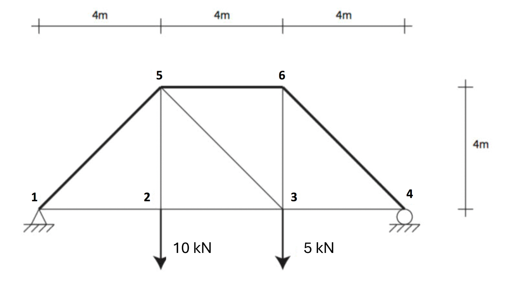
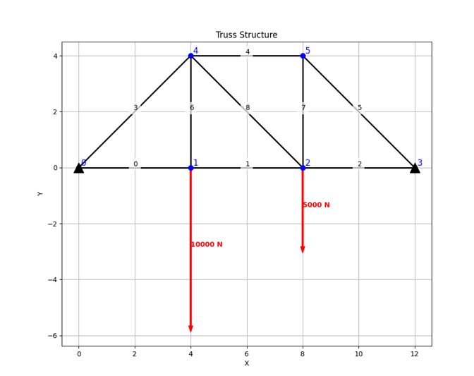
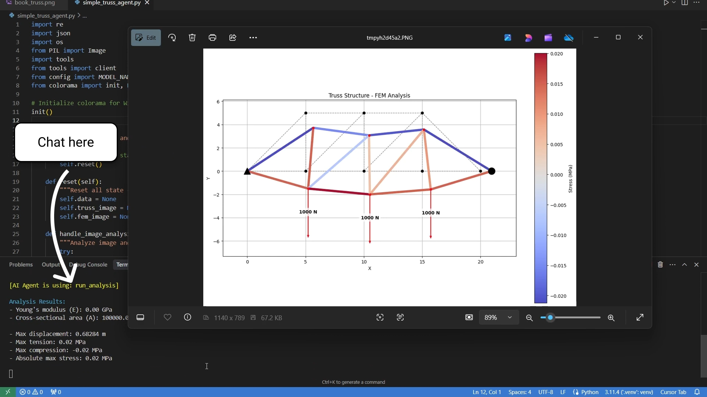

# Simple Truss Analysis Agent

A minimal implementation of an AI-powered truss analysis tool that demonstrates how to combine LLMs with engineering calculations. This project shows how to create a simple agent that can interpret truss drawings and perform structural analysis.

## Overview

This implementation uses Claude 3.7 to:
- Extract truss geometry from images
- Perform structural analysis using FEM
- Provide interactive analysis through a chat interface

## How It Works

### 1. Provide an Image
Simply specify the path to your truss image in `simple_truss_agent.py`:
```python
image_path = "./images/book_truss.png"
truss_chat(image_path)
```



### 2. Image Analysis
The agent analyzes the image and extracts the truss geometry, including:
- Node locations
- Element connections
- Applied forces
- Support conditions



### 3. Interactive Analysis
Chat with the agent to:
- Run structural analysis
- Modify the truss geometry
- Get detailed results
- Ask engineering questions



## Setup

1. Install dependencies:
   ```bash
   pip install -r requirements.txt
   ```

2. Configure your Anthropic API key in `config.py`:
   ```python
   ANTHROPIC_API_KEY = "your-api-key-here"
   ```

3. Run the application:
   ```bash
   python simple_truss_agent.py
   ```

## Usage

The agent can:
- Analyze truss images and extract geometry
- Calculate displacements and stresses
- Answer questions about the analysis results

Example commands:
```
> Run analysis with E=200e9 Pa and A=0.001 m²
> Increase the hight of the truss by 2 meters.
> Find the smallest IPE profile we can use, while keeping the stress under 200 MPa
```

## Project Structure

- `simple_truss_agent.py`: Main application with chat interface
- `tools.py`: Core functionality for truss analysis
- `config.py`: Configuration settings
- `images/`: Example truss structure images

## Input Requirements

- Clear truss image. 

## License

MIT License - see [LICENSE](LICENSE) file for details.